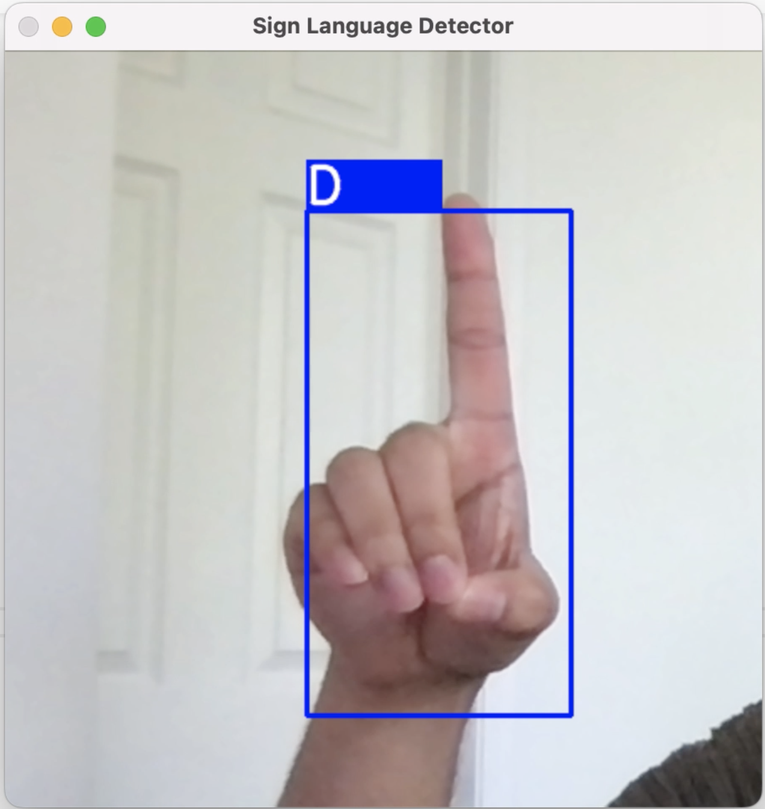
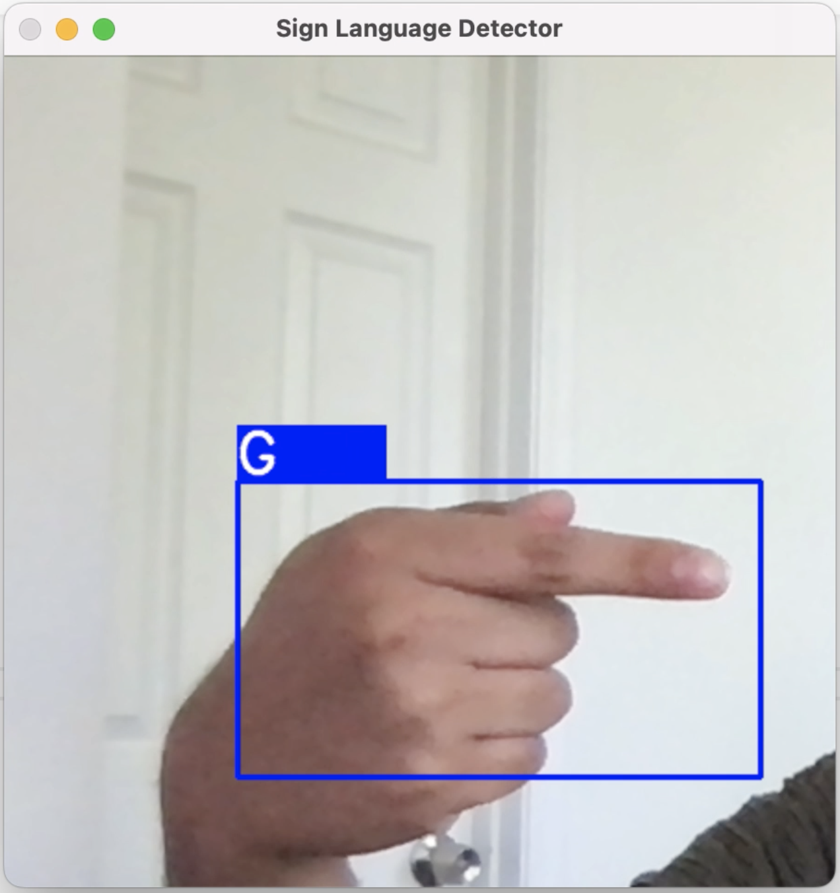
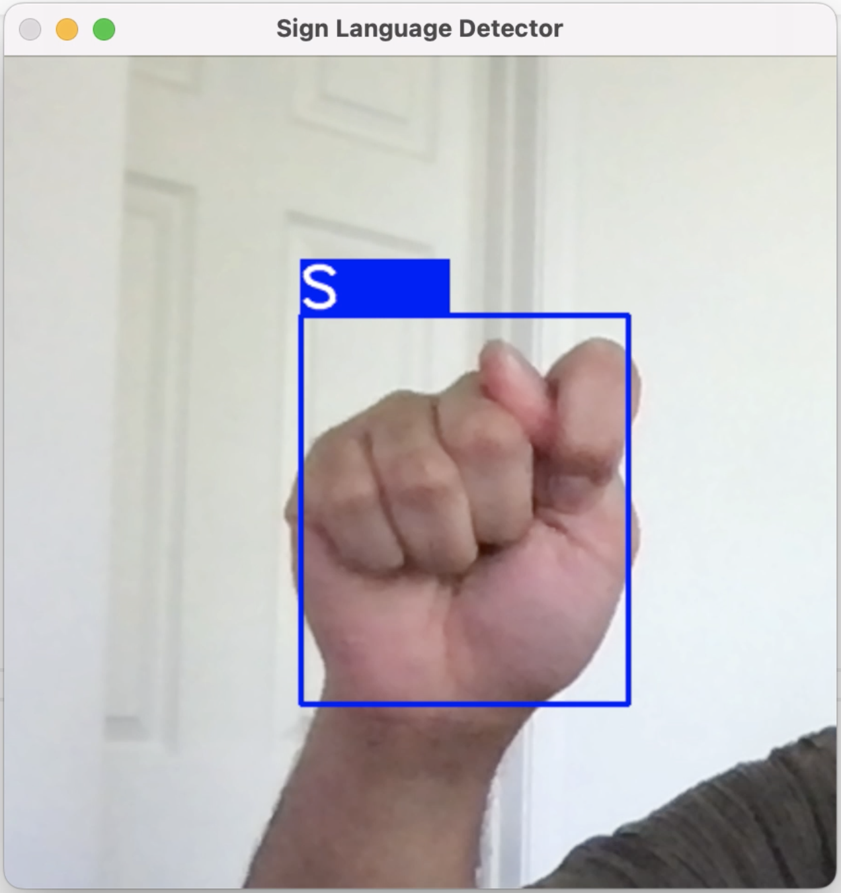

# Sign Language Detection Project

Disclaimer: I am not fluent nor educated in ASL sign language and fingerspelling, so the signs and trained and tested the model on are most likely incorrect form. The purpose of this project was solely to educate myself on object detection and classification.
## Live Video Feed Testing Results

### Test A

### Test B

### Test C

### Test D

### Test E

### Test F

### Test G

### Test H

### Test I

### Test J
Note: Although J is a dynamic sign, model only recognizes static image of J.

### Test K

### Test L

### Test M
Note: Model had difficulty recognizing M and classified it as S.

### Test N
Note: Model had difficulty recognizing N and classified it as S.

### Test O

### Test P

### Test Q

### Test R

### Test S

### Test T
Note: Model had difficulty recognizing T and classified it as S.

### Test U

### Test V

### Test W

### Test X

### Test Y

### Test Z
Note: Although Z is a dynamic sign, model only recognizes static image of Z.
